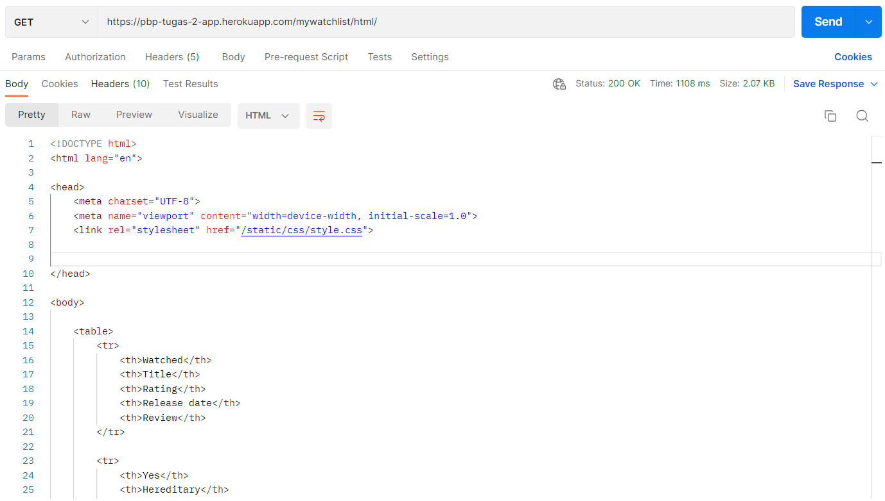
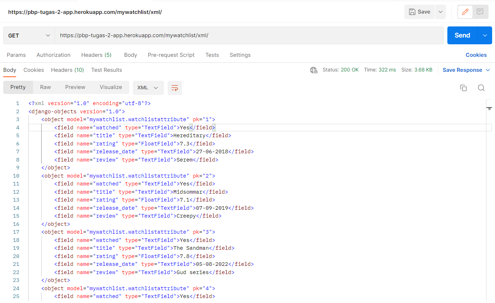
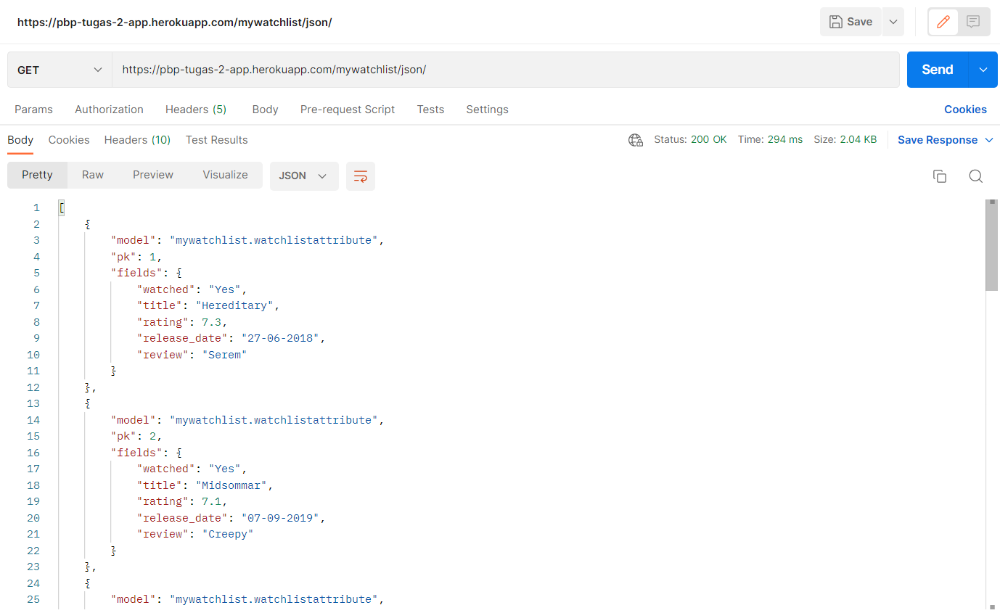

### **Link aplikasi Heroku**
https://pbp-tugas-2-app.herokuapp.com/mywatchlist/html/ 
https://pbp-tugas-2-app.herokuapp.com/mywatchlist/xml/ 
https://pbp-tugas-2-app.herokuapp.com/mywatchlist/json/ 

### **Jelaskan perbedaan antara JSON, XML, dan HTML!**
HTML(Hyper Markup Text Language) adalah sebuah bahasa *markup* untuk dokumen-dokumen yang didesain untuk di-_display_ di  web browser. Dengan HTML, kita bisa membuat paragraf, *link*, dan membagi halaman menjadi berbagai _subsection_ menggunakan elemen HTML seperti tag dan attribute.

Perbedaan utama antara HTML dengan XML dan JSON adalah HTML didesain untuk men-*display* data; bagaimana data tersebut dipresentasikan pada web page, sedangkan XML dan JSON didesain sebagai sebuah format data yang berfungsi untuk menyimpan data dan men-*transport* data.

XML(eXtensible Markup Language) adalah sebuah _markup_ language yang didesain untuk menyimpan dan memindahkan data.

JSON(JavaScript Object Notation) sama seperti XML, adalah sebuah format yang digunakan untuk menyimpan dan memindahkan data. Yang membedakan adalah :

- JSON memiliki *syntax* yang berbeda, JSON tidak menggunakan end tag.
- JSON lebih pendek sehingga lebih efisien untuk dibaca dan dibuat.
- JSON bisa menggunakan array.
- XML harus di-*parse* menggunakan XML *parser*, sedangkan JSON bisa di-*parse* menggunakan fungsi *JavaScript* .

References : 
https://www.w3schools.com/js/js_json_xml.asp 
https://www.w3schools.com/xml/xml_whatis.asp 

### **Jelaskan mengapa kita memerlukan data delivery dalam pengimplementasian sebuah platform?**
Karena data yang diminta oleh HTTP *request* harus di-*return* dengan data yang sesuai.

### **Jelaskan bagaimana cara kamu mengimplementasikan checklist di atas.**
- [x] Menjalankan `python manage.py startapp mywishlist`.
- [x] Menambahkan *path* `mywatchlist` pada `urlpatterns` di file `urls.py` pada folder  `project_django`.
- [x] Membuat class `MyWatchListAttribute` di file `models.py` yang berisi variabel atribut-atribut yang diminta dengan fieldnya yang sesuai.
- [x] Membuat file `watchlist_data.json` yang berisi 10 data dengan atribut yang sesuai dengan `models.py`.
- [x] Menambahkan fungsi yang sesuai pada `views.py` untuk menampilkan data dalam format HTML, XML, dan JSON.
- [X] Melakukan routing dengan menambahkan *path* yang sesuai dengan fungsi pada `urlpatterns` di file `urls.py` pada folder `mywatchlist`.
- [x] *Add*, *commit*, dan *push* perubahan yang dilakukan, maka otomatis akan dilakukan *deployment* ke aplikasi Heroku yang dibuat di tugas sebelumnya

### Postman
HTML

XML

JSON
